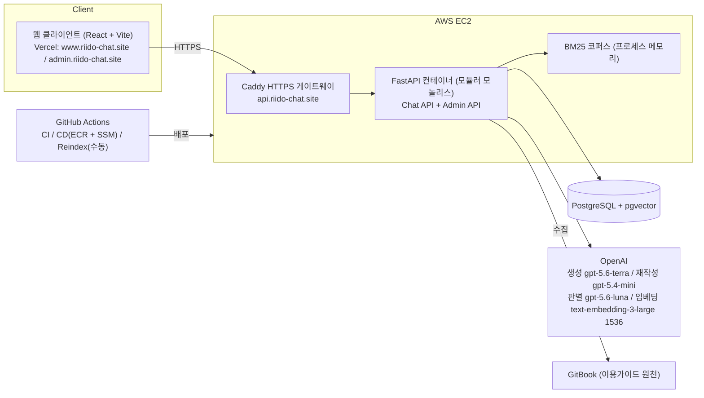
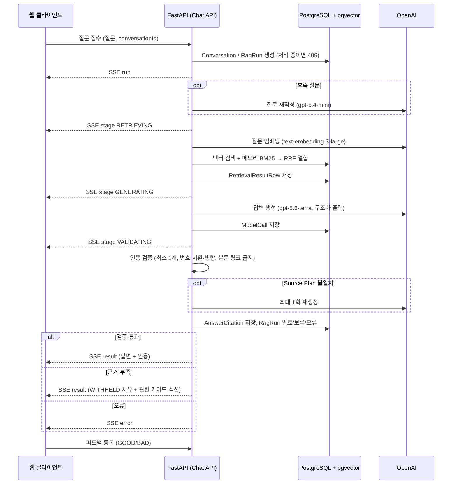

# 뤼이도 이용가이드 RAG 챗봇 — 백엔드 저장소

뤼이도 이용가이드를 근거로만 답하는 문서 기반(RAG) 서비스 사용 안내 챗봇.
주식회사 스위그(제품 뤼이도) 제안 과제로 2026-07-27 부터 8주간 4인 팀이 만든 웹 서비스다.

## 프로젝트 소개

**문제.** 브리핑은 이용가이드가 있어도 사용자가 겪는 문제를 탐색 비용, 반복 문의, 정착 실패 세 가지로 정의했다. 사용자는 가이드에서 답을 찾는 데 시간을 쓰고, 같은 질문이 반복해서 들어오며, 기능을 익히지 못한 채 이탈한다.

**서비스.** 사용자가 질문하면 챗봇이 이용가이드에서 관련 절을 찾아 근거(출처 번호)와 함께 답한다. 근거가 부족하면 답을 지어내지 않고 사유를 붙여 보류한다. 운영자는 콘솔에서 가이드 문서를 올리고 검색에 반영하며, 질문 로그를 세부 문제 단위로 보고 승인된 정본 답변을 캐시로 서빙할 수 있다.

**주요 목표**
- 한국어 형태소 BM25 와 벡터 검색을 RRF 로 결합한 하이브리드 검색으로 가이드 절을 찾는다.
- 서버가 인용을 검증한 답변만 내보내고, 근거가 부족하면 사유 4종 중 하나로 보류한다.
- 멀티턴 후속 질문, 근거 보기, 답변 피드백까지 MVP 흐름을 완결한다.
- 대화·검색·모델 호출·인용·피드백을 실행 단위로 기록한다.
- 임베딩·생성 모델은 같은 평가셋으로 비교해 수치와 비용을 근거로 선택한다.

**개선 완료 목표**
- 고도화 1차 — 운영 콘솔 문서 관리: 운영자가 개발자 없이 문서 업로드·수정본 업로드·GitBook 수집·검색 반영을 수행하고, 색인은 검증을 통과해야 원자적으로 교체된다.
- 고도화 2차 — 질문 로그와 정본 캐시: 질문을 세부 문제로 판별·집계하고, 승인된 정본은 검증 게이트를 거쳐 서빙한다. 추천 질문은 정확 일치 캐시로 즉시 응답하고 세부 문제별 정본 답변을 준비했다.

## 기술 스택

**Frontend**


**Backend**


**Database · Search**


**LLM · Embedding**


**Infra · CI/CD**


## 팀 구성

| 항목 | 내용 |
|---|---|
| 팀명 | 스위그 2팀 |
| 기간 | 2026-07-27 부터 8주, 최종 발표 2026-09-18 |
| 협업 방식 | 뤼이도 티켓(2-NNN) 단위 작업, PR 단위 병합과 CI 검증, Figma 화면·상태-문구 매핑을 SSoT 로 공유, 멘토링 8회차와 담당 기업 피드백 3·6·8주차 |

<table>
  <tr>
    <td align="center"><a href="https://github.com/Ji-minhyeok"></a><br/><b>지민혁</b></td>
    <td align="center"><a href="https://github.com/codedbyminjae"></a><br/><b>김민재</b></td>
    <td align="center"><a href="https://github.com/unanbb"></a><br/><b>이윤환</b></td>
    <td align="center"><b>노현지</b><!-- GitHub ID 생성 뒤 프로필 링크 추가 --></td>
  </tr>
  <tr>
    <td align="center">팀장 · BE · 인프라 · PM/PO</td>
    <td align="center">BE · RAG</td>
    <td align="center">FE</td>
    <td align="center">UX/UI</td>
  </tr>
  <tr>
    <td>로깅·ERD, CI/CD·게이트웨이·도메인, 운영 콘솔 문서 관리 API, 질문 로그 콘솔 API, 질문 판별·정본 캐시 서빙, 범위 재정의·주차 목표</td>
    <td>문서 파이프라인(GitBook 수집), 검색(BM25·벡터·RRF), 답변 생성·인용 검증, 멀티턴, 임베딩·생성 모델 비교 평가</td>
    <td>채팅 UI, 근거 보기, 피드백, 운영 콘솔 화면, Vercel 배포</td>
    <td>Figma 디자인 시스템, 챗봇·운영 콘솔·질문 로그 화면 설계</td>
  </tr>
</table>

## 시스템 구조



| 구성 요소 | 책임 |
|---|---|
| 웹 클라이언트 (Vercel) | 챗봇 화면(`www.riido-chat.site`)과 운영 콘솔(`admin.riido-chat.site`). develop push 시 Vercel Production 자동 배포 |
| Caddy 게이트웨이 | `api.riido-chat.site` HTTPS 종단, 내부 운영 경로 외부 차단, API 컨테이너로 리버스 프록시 |
| FastAPI 컨테이너 | Chat API·Admin API·내부 API 를 단일 컨테이너로 제공. Chat/Admin/Indexer 분리는 트래픽·운영 요구 발생 시 재검토 |
| PostgreSQL + pgvector | 문서·절·청크·임베딩, 색인 버전, 대화·실행 로그, 질문 그룹핑·정본 |
| BM25 코퍼스 | 호스트 볼륨을 읽기 전용 마운트해 프로세스 메모리에 적재. Redis 없이 단일 인스턴스로 운영 |
| OpenAI | 답변 생성(terra), 질문 재작성(mini), 질문 판별(luna), 임베딩(text-embedding-3-large 1536차원) |
| GitHub Actions | PR 마다 CI, develop push 시 ECR 이미지 빌드·SSM 배포, 재색인은 수동 실행 |

## 주요 기능

**챗봇 (MVP)**
- 질문을 받으면 Kiwi 형태소 BM25 와 pgvector 벡터 검색을 RRF 로 결합해 가이드 절을 찾는다. 2026-09-08 평가(문서 39개·청크 142개·질문 30문항)에서 Recall@5 96.67%, Recall@10 100%.
- 답변은 서버가 인용을 검증한 뒤 한 번에 내보낸다. 완료 답변에는 최소 1개 인용이 붙고, 본문에는 링크·HTML·내부 식별자를 넣지 않는다.
- 근거가 부족하면 INSUFFICIENT_EVIDENCE / AMBIGUOUS_QUESTION / OUT_OF_SCOPE / UNVERIFIABLE_ANSWER 사유로 보류하고, 보류 시에도 관련 가이드 섹션을 안내한다.
- 후속 질문은 대화 맥락을 붙여 재작성하며(최대 5턴), 답변에 GOOD/BAD 피드백을 남길 수 있다.

**운영 콘솔 문서 관리 (고도화 1차)**
- 문서 그룹 단위로 신규 업로드, 수정본 업로드, GitBook 수집, 검색 반영을 콘솔 버튼으로 수행한다.
- 업로드는 sha256 해시로 NO_CHANGE / 수정본 / 중복 / 신규를 판정하고, 같은 그룹 작업은 하나만 동시 실행된다.
- 검색 반영은 BUILDING→VALIDATING→APPLYING 을 모두 통과해야 새 색인이 ACTIVE 로 교체된다. 상태값은 UP_TO_DATE / REINDEX_REQUIRED / IN_PROGRESS / NO_DOCUMENTS / FAILED.

**질문 로그와 정본 캐시 (고도화 2차)**
- 질문을 세부 문제 단위로 판별해 대시보드·문서별·세부 문제별로 집계하고, 답변 상태(ANSWERED / CACHED_ANSWER / WITHHELD / ERROR)로 필터한다.
- 승인된 정본은 판별 결과·정본 버전·인용 유효성·서빙 상태를 검사하는 게이트를 거쳐서만 서빙된다. SHADOW 상태에서는 시도 결과만 기록한다.
- 골든셋(질문 96문항·세부 문제 30개·정본 30개·대표 질문 60개)으로 세부 문제 적중 129/136, 오수락 2/56 기준선을 관리한다.
- 추천 질문은 정확 일치 캐시로 즉시 응답한다.

## 협업 방식

- 뤼이도 작업 항목(2-NNN)을 브랜치·PR 에 대응시키고, PR 은 CI(마이그레이션 + 테스트)를 통과해야 develop 에 병합한다.
- 화면은 Figma 페이지, 상태-문구 매핑은 별도 문서를 SSoT 로 두고 옛 문서는 폐기했다.
- 멘토링 피드백(ERD 구조, 보류 완화, 모델 비교 등)과 담당 기업 요청을 병합 PR 로 추적할 수 있게 대응했다.
- 브리핑 요구를 MVP / 1차 / 2차 / 제외로 재정의하고 주차 목표(3주 최소 구현, 4주 MVP, 5주 안정화, 6주 콘솔, 7주 분석·성능, 8주 검증)를 문서로 확정했다.

## 고도화 로드맵

- 정본 캐시 운영 전환: SHADOW 관찰 → 세부 문제별 SERVING 전환 → 프로필 캐시 켜기 순으로 단계적 적용. 과거 턴 소급 분류와 사용자 원문 표시는 후속 과제.
- 콘솔 화면: 자주 묻는 질문 Top·무응답 질문 목록 화면(API 는 운영 중), 질문 로그 1차·2차 화면(디자인 있음).
- 문서 관리: 문서 버전 조회/롤백/삭제, 색인 수동 적용, 다중 인스턴스 동기화, 재색인 CLI 정리.
- 기업 요청 중 미대응: URL 매핑, 개념 질문 외부 URL 연결(본문 링크 금지 정책과 상충), 콘솔 "마지막 업데이트" 표시·주기 갱신.
- 그 밖: 실제 인증 연동(현재 mock), 비용 최적화, 캐시로 생략된 비용 측정(실제 반복률 필요), 추천 질문 목록 확정, FE E2E 테스트, LLM·임베딩 제공자 비결합 인터페이스.

---

## 백엔드

### 기술 스택 상세

| 영역 | 브리핑 예시 | 선택 | 이유 |
|---|---|---|---|
| BE | NestJS | Python 3.12, FastAPI, SQLAlchemy(asyncio) + asyncpg, pydantic-settings, uvicorn | - |
| DB | PostgreSQL | PostgreSQL + pgvector (`pgvector/pgvector:0.8.6-pg18-bookworm`), Alembic 1.16 | 로컬 compose 와 CI 가 같은 이미지를 사용 |
| 키워드 검색 | PostgreSQL FTS | Kiwi 형태소 분석(kiwipiepy) + BM25(rank-bm25) | 한국어 조사·어미 처리 한계(8/5 논의안) |
| 결합 | - | RRF(1/(k+rank) 합산) 하이브리드. v1 BM25 → v2 벡터 → v3 RRF → v4 Query Rewrite·근거 판정 안정화 | Recall@5 96.67%, Recall@10 100% (2026-09-08 평가셋) |
| 캐시 | Redis(Cache-aside) | 미사용. BM25 코퍼스를 프로세스 메모리에 두고 내부 적재 호출로 갱신 | 단일 인스턴스 운영 구조 |
| 임베딩 | - | OpenAI `text-embedding-3-large` 1536차원 | 2026-09-08 비교 평가로 유지 확정 |
| 생성 모델 | - | OpenAI `gpt-5.6-terra`, 답변 프롬프트 v40 | 95건 중 95건 통과(오류 0) vs `gpt-5.4-mini` 93건. 비용 $1.42 vs $0.53, 평균 지연 4,666ms vs 3,286ms(2026-09-08, 95건). 품질 우선 |
| 재작성·판별 | - | 재작성 `gpt-5.4-mini`(v10, timeout 30초, 재시도 2회), 판별 `gpt-5.6-luna`(question-grouping-v7-2, timeout 20초, 총 2회 시도) | - |
| 구조 | Docker | 단일 FastAPI 컨테이너 "도메인 중심 모듈러 모놀리스" | 분리는 트래픽·운영 요구 발생 시 재검토(2026-09-04 결정) |

NestJS 대신 FastAPI 를 택한 이유는 기록이 없어 적지 않는다.

### 주요 기능 상세

#### 챗봇
- 인용 검증: citation marker 를 내부 SOURCE_id 에서 최종 번호로 치환하고 같은 문서·절 출처는 번호를 병합한다. 본문의 마크다운 링크·HTML·내부 식별자는 정규식 7종으로 검증 실패 처리한다.
- 답변 프롬프트는 Grounding / Answerability / Answer style / Citation / Structured Output 5개 규칙군으로 ANSWERABLE 또는 WITHHELD 를 구조화 출력한다. Source Plan 과 WITHHELD 여부가 불일치하면 최대 1회 재생성하고 실패 시 UNVERIFIABLE_ANSWER 로 보류한다.
- 멀티턴: QueryRewriteService 가 후속 질문을 독립 질의로 재작성한다(최대 5턴, 질의 4000자). 문맥이 모호한 대명사 질문은 별도 보류 경로로 처리한다. 대화는 24시간 비활성 시 만료되고 처리 중 중복 요청은 409 다.
- 피드백은 완료·보류 답변에만 허용한다(409 FEEDBACK_NOT_ALLOWED).
- 고도화/개선 사항: 보류 완화(관련 안내 #166, 보류 시 관련 가이드 섹션 #176, 범위 밖 판정 #178), 답변 일관성 fix(#130, #170), 절차형 질문 근거 판정 통일(#152), 대화 프로필 기반 문서 그룹 라우팅(#169).

#### 운영 콘솔 문서 관리
- AdminIngestionService 가 그룹 단위 잠금 아래 업로드를 처리하며 같은 이름·같은 해시=NO_CHANGE, 같은 이름·다른 해시=수정본, 다른 이름·같은 해시=409 DUPLICATE_CONTENT, 다른 이름·다른 해시=신규로 판정한다. 임베딩은 업로드 시점에 생성한다.
- 검색 반영은 그룹 잠금 안에서 DB ACTIVE 포인터와 메모리 CorpusState 를 원자적으로 교체한다. 내부 단계는 API 응답에 노출하지 않는다.
- GitBook 수집은 sourceUrl 기준으로 목록·본문을 가져와 성공/실패/삭제를 집계하고, 같은 루트 URL 재호출이 곧 재수집이다. 한 그룹에 여러 GitBook 을 허용한다.
- 업로드·검색 반영·GitBook 수집은 동기 처리 후 200 을 반환한다(409 JOB_IN_PROGRESS 는 방어용).
- 고도화/개선 사항: 도메인 패키지 재배치(#113), 임베딩 생성 시점을 색인에서 업로드로 이동(#115), 관리자 API 오류 형식(code, message) 통일.

#### 질문 로그와 정본 캐시
- 데이터 모델 8개(QuestionProblemGroup, QuestionSubproblem(+revision), ClassificationRun, QuestionClassification, QuestionEmbedding, CanonicalAnswer(+citation), QuestionCacheAttempt).
- 캐시 게이트 순서: 판별 실패 → 비연결 → 정본 없음/버전·인용 검사 실패 → SHADOW → SERVING 아님 → 프로필 캐시 꺼짐 → SERVED. 정본 인용은 문서 판이 바뀌어도 같은 청크 → 같은 절 신원·내용 해시 → 내용 해시 순으로 재해석하고 실패 시 거절한다.
- 세부 문제 서빙 상태 UNUSED / SHADOW / SERVING / STOPPED. 정본은 origin(SELECTED/AUTHORED)·approval(DRAFT/APPROVED/REVOKED) 상태를 가지며 세부 문제당 APPROVED 정본은 하나다.
- 전체 기능은 `QUESTION_GROUPING_ENABLED` 스위치로 제어하며 기본값은 꺼짐이다. 꺼진 상태의 과거 턴은 unclassifiedQuestionCount 로 별도 집계한다.
- 고도화/개선 사항: 세부 문제별 정본 답변 준비, 추천 질문 정확 일치 캐시, 골든 기준선(적중 129/136, 오수락 2/56, INVALID 0, 2026-09-15).

### 요청 처리 흐름



- SSE 이벤트 순서는 `run` → (`stage`)* → `result` 또는 `error` 로 고정되며 전달 계약은 ordered / at-most-once / best-effort / no-replay 다. `Accept: text/event-stream` 요청만 SSE 로 분기하고, 현재 FE 는 동기 JSON 응답으로 연동한다.
- 답변 본문은 토큰 스트리밍하지 않고 인용 검증을 마친 뒤 `result` 한 번으로 보낸다.
- 질문 판별 스위치가 켜져 있으면 판별과 정본 캐시 게이트가 이 흐름에 추가되고 판별행·캐시 시도·질문 임베딩이 저장된다.

### 데이터 모델 요약

- 문서: Document(URL SHA-256 12자리) → Section → Chunk(1:1). 원천은 GitBook(llms.txt 목록 → 페이지 마크다운)과 콘솔 업로드 마크다운. 문서 그룹과 색인 버전(IndexVersion, ACTIVE 포인터)이 그룹별 검색 코퍼스를 정한다.
- 대화·로그: Conversation, RagRun(턴), RetrievalResultRow(후보 청크별), ModelCall, AnswerCitation, Feedback. 멘토링 2주차 ERD 피드백을 반영한 실행 단위 로깅 구조.
- 대화 프로필: chat profile 로 문서 그룹 라우팅과 런타임 계약을 동기화한다.
- 질문 그룹핑: 위 8개 테이블.
- 마이그레이션은 `alembic/versions/` 에 14개(2026-08-18 `01_create_vector_tables` 부터 2026-09-15 `14_drop_unused_question_log_and_legacy_tables` 까지).

### 로컬 실행

```bash
pip install -r requirements.txt                      # Python 3.12
docker compose -f docker-compose.db.yml up -d        # PostgreSQL + pgvector
alembic upgrade head                                 # 스키마 마이그레이션
uvicorn app.main:app --host 0.0.0.0 --port 8000      # Dockerfile CMD 와 동일
```

환경변수(`app/core/config.py`, `.env` 를 읽으며 환경변수가 우선): `APP_ENV`, `DATABASE_URL`, `OPENAI_API_KEY`, `CORPUS_DIR`, `CORS_ORIGINS`, `QUESTION_GROUPING_ENABLED`. DB 컨테이너용: `POSTGRES_DB`, `POSTGRES_USER`, `POSTGRES_PASSWORD`, `POSTGRES_BIND_HOST`, `POSTGRES_PORT`.

BM25 코퍼스는 ACTIVE 색인이 있을 때 기동 시 적재되고, 없으면 미적재 상태로 기동하며 내부 적재 호출로 별도 적재한다. `scripts/chat_cli.py` 로 실행 중인 Chat API 를 터미널에서 확인할 수 있다.

### 테스트

```bash
python -m unittest discover -s tests -v
```

- CI(`.github/workflows/ci.yml`)는 develop/main 대상 PR 마다 pgvector Postgres 컨테이너를 띄우고 `alembic upgrade head` 후 위 명령을 실행한다.
- `tests/` 의 `*_db.py` 는 DB 통합 테스트로 `DATABASE_URL` 과 마이그레이션이 준비돼야 실행된다. 검색·생성·멀티턴 평가용 테스트와 Chat API·DB E2E 수용 baseline(`test_chat_acceptance_db.py`)도 같은 디렉터리에 있다.
- `evaluation/` 에는 평가 스크립트·데이터와 `baselines/` 재실행 기록이 있다.

### 배포 자동화

```text
[PR → develop/main]   ci.yml      pgvector 컨테이너 기동 → pip install → alembic upgrade head → unittest
[push develop]        deploy.yml  OIDC 자격증명 → docker build → ECR push → deploy.sh·compose 를 S3 업로드
                                  → SSM RunCommand 로 앱 EC2 에서 deploy.sh 실행 → 최대 15분(90회×10초) 폴링
[수동 실행]           reindex.yml reindex.sh 를 S3 업로드 → SSM 으로 앱 EC2 에서 그룹별 재색인 → 최대 30분 대기
```

| 파일 | 역할 |
|---|---|
| `.github/workflows/ci.yml` | PR 마다 마이그레이션 + 테스트 |
| `.github/workflows/deploy.yml` | develop push 시 ECR 이미지 빌드, SSM 배포(SSH 미사용) |
| `.github/workflows/reindex.yml` | 수동 재색인. OpenAI 비용 때문에 자동 트리거 없음 |
| `scripts/deploy.sh` | 앱 EC2 에서 이미지 URI 를 받아 `docker-compose.api.prod.yml` 갱신 |
| `scripts/reindex.sh` | READY 문서만 그룹별 재색인 호출 후 코퍼스 재적재 |
| `docker-compose.api.prod.yml` | API 컨테이너. 로컬 바인딩, 데이터 디렉터리 읽기 전용 마운트, 헬스체크 |
| `docker-compose.gateway.prod.yml`, `infra/caddy/Caddyfile` | Caddy HTTPS 게이트웨이, 내부 운영 경로 외부 차단 |
| `docker-compose.db.yml` | 로컬 PostgreSQL + pgvector |

운영 상태: develop 최신 병합(2026-09-15)까지 운영 배포가 완료됐고 도메인 적용도 끝났다.

### 주요 도메인 구조

```text
app/
├── main.py              # 앱 생성, 라우터 등록, 예외 처리, 기동 시 코퍼스 적재
├── admin/               # 운영 콘솔 문서 관리 라우터·그룹 서비스, question_insights/ (질문 로그 콘솔 API)
├── answering/           # 답변 생성(GenerationService, OpenAIGenerator)
├── api/                 # health, internal(코퍼스 적재·재적재)
├── chat/                # Chat API, SSE 스트림, 피드백, RagRun 조회, 질문 재작성, 프로필, 로그 저장
├── core/                # 설정, 해시, 모델 호출 추적, OpenAI 오류·사용량
├── database/            # 세션, ORM 모델
├── document/            # 문서 그룹, 로더·섹션 파서·청커, 업로드(ingestion), GitBook 수집, 작업 잠금
├── indexing/            # 색인 실행(BUILDING→VALIDATING→APPLYING), 벡터 코퍼스 기록
├── ops/                 # 시드·백필·정본 생성 운영 스크립트
├── question_grouping/   # 질문 판별, 캐시 게이트, 정본 검증, 저장소, 프롬프트 v7-2
└── retrieval/           # Kiwi 분석기, BM25·벡터·하이브리드 검색, 코퍼스 상태, 임베딩
```
